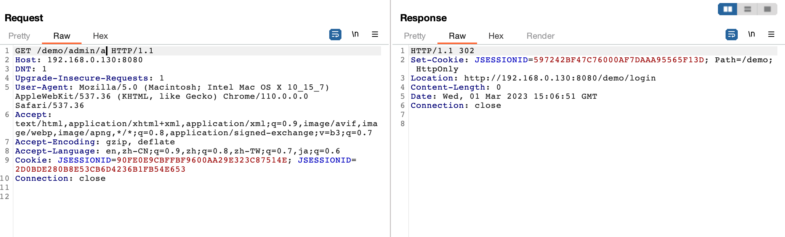
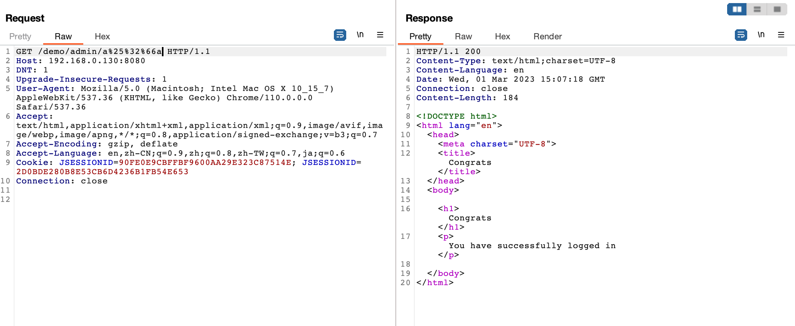
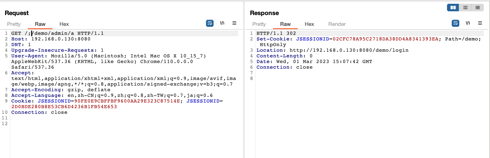

# Apache Shiro Authentication Bypass Vulnerability (CVE-2020-11989)

Apache Shiro is a powerful and easy-to-use Java security framework that performs authentication, authorization, cryptography, and session management.

Apache Shiro before 1.5.3, in some cases, double encoding with the character '/' (%25%32%66) can bypass Shiro's authorization.

References:

- <https://github.com/apache/shiro/commit/589f10d40414a815dbcaf1f1500a51f41258ef70>
- <https://xz.aliyun.com/t/11633#toc-28>
- <https://cve.mitre.org/cgi-bin/cvename.cgi?name=CVE-2020-11989>

## Vulnerable Environment

Start an application with Spring and Shiro 1.5.2 by executing the following command.

```
docker-compose up -d
```

Once the environment is started, visit ``http://your-ip:8080`` to see the home page.

## Vulnerability Reproduce

A direct request to the admin page `/demo/admin/a` is inaccessible and will be redirected to the login page.



Construct a malicious request `/demo/admin/a%25%32%66a` to bypass authentication checks and access the admin page.



Construct a malicious request `/;/demo/admin/a` to bypass authentication checks and access the admin page.



