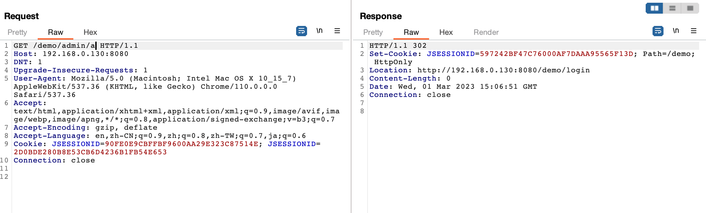
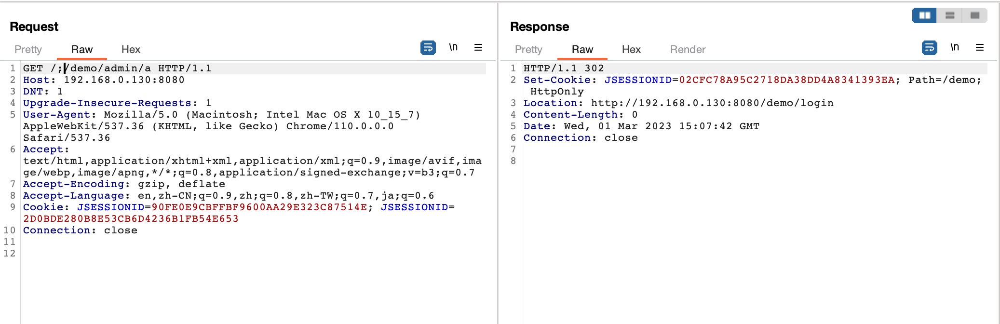

# Apache Shiro 认证绕过漏洞（CVE-2020-11989）

Apache Shiro是一款开源安全框架，提供身份验证、授权、密码学和会话管理。Shiro框架直观、易用，同时也能提供健壮的安全性。

在Apache Shiro 1.5.3以前的版本中，使用字符 '/' 的二次编码（%25%32%66) 在某些情况下可以绕过Shiro 的权限验证。

参考链接：

- <https://github.com/apache/shiro/commit/589f10d40414a815dbcaf1f1500a51f41258ef70>
- <https://xz.aliyun.com/t/11633#toc-28>
- <https://cve.mitre.org/cgi-bin/cvename.cgi?name=CVE-2020-11989>

## 环境搭建

执行如下命令启动一个搭载Shiro 1.5.2的应用：

```
docker-compose up -d
```

环境启动后，访问`http://your-ip:8080`即可查看首页。

## 漏洞复现

直接请求管理页面`/demo/admin/a`，无法访问，将会被重定向到登录页面：



构造恶意请求`/demo/admin/a%25%32%66a`，即可绕过权限校验，访问到管理页面：


构造恶意请求`/;/demo/admin/a`，即可绕过权限校验，访问到管理页面：

